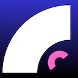

<div align="center">



# YT Focus

**Take back control of your YouTube experience.**

Remove Shorts, recommendations, comments, autoplay, and every other distraction — without leaving the tab.

[](https://developer.chrome.com/docs/extensions/mv3/intro/)
[](https://react.dev/)
[](https://www.typescriptlang.org/)
[](https://vitejs.dev/)
[](LICENSE)

[Install (No Build Required)](#-install-no-build-required) · [Features](#-features) · [Contributing](#-contributing) · [Roadmap](#-roadmap)

---

</div>

## ✨ Features

| Feature | Description |
|---|---|
| 🚫 **Hide Shorts** | Removes Shorts shelf from home, search, and subscriptions |
| 🚫 **Hide Shorts tab** | Removes the Shorts entry from the sidebar navigation |
| 🚫 **Hide home feed** | Clears the entire recommendation grid on the homepage |
| 🚫 **Hide recommendations** | Removes the right sidebar on the watch page |
| 🚫 **Hide end cards** | Removes overlay cards at the end of videos |
| 🚫 **Hide comments** | Collapses the entire comments section |
| 🚫 **Hide autoplay** | Removes the autoplay toggle and next-video button |
| 🚫 **Hide live chat** | Hides the chat panel on live streams |
| 🚫 **Hide merch shelf** | Removes merchandise and product shelves |
| 🔁 **Redirect Shorts** | Auto-redirects `/shorts/` URLs to the standard `/watch` player |
| ⏱️ **Focus timer** | Pomodoro-style countdown overlay directly on YouTube |
| 🎛️ **Presets** | One-click Study / Music / Relax mode configurations |
| 🔄 **Settings sync** | All settings sync across your Chrome devices automatically |
| 🔴 **OFF badge** | Icon shows "OFF" badge when the extension is disabled |

---

## 📦 Install (No Build Required)

> No Node.js. No terminal. Just download and load.

### Step 1 — Download the latest release

Go to the [**Releases page**](../../releases) of this repository and download the file named `yt-focus-dist.zip` from the latest release.

### Step 2 — Unzip it

Extract the zip anywhere on your computer. You'll get a folder called `dist/`.

### Step 3 — Load it in your browser

**Chrome / Brave / Edge / Arc — any Chromium browser works.**

1. Open your browser and go to:
   ```
   chrome://extensions
   ```
   *(For Brave, use `brave://extensions`. For Edge, use `edge://extensions`.)*

2. Enable **Developer mode** using the toggle in the **top-right corner**.

3. Click **"Load unpacked"**.

4. Select the `dist/` folder you just extracted.

5. ✅ Done. The YT Focus icon appears in your toolbar. Click it to configure.

> **Tip:** Pin the extension to your toolbar by clicking the puzzle piece icon (🧩) and pinning YT Focus.

---

## 🔄 Updating to a New Version

1. Download the new `yt-focus-dist.zip` from the [Releases page](../../releases).
2. Extract it, **replacing** your old `dist/` folder.
3. Go to `chrome://extensions`.
4. Find YT Focus and click the **↺ refresh icon**.

---

## 🛠️ Build from Source

If you want to modify the code or run it locally in development mode:

### Prerequisites

- [Node.js](https://nodejs.org/) 18 or higher
- A Chromium browser (Chrome, Brave, Edge, Arc)

### Setup

```bash
# 1. Clone the repository
git clone https://github.com/22Arjun/yt-focus.git
cd yt-focus

# 2. Install dependencies
npm install

# 3. Generate icons from your source image (optional — skip if icons already exist)
node scripts/generate-icons.mjs

# 4. Start the dev build (auto-rebuilds on every file save)
npm run dev
```

### Load the dev build

1. Open `chrome://extensions`
2. Enable **Developer mode**
3. Click **Load unpacked** → select the `dist/` folder
4. Make changes to `src/` — the extension rebuilds automatically
5. Click **↺ refresh** on the extensions page after each rebuild

### Production build

```bash
npm run build
```

The `dist/` folder is ready to zip and distribute.

---

## 🗂️ Project Structure

```
yt-focus/
├── public/
│   └── icons/               ← Extension icons (16, 32, 48, 128px)
├── scripts/
│   └── generate-icons.mjs   ← Generates all icon sizes from public/icon.png
├── src/
│   ├── shared/
│   │   └── settings.ts      ← Settings schema, defaults, presets, storage helpers
│   ├── content/
│   │   ├── content.ts       ← DOM manipulation, MutationObserver, SPA navigation
│   │   └── content.css      ← CSS selectors that hide YouTube elements
│   ├── background/
│   │   └── service-worker.ts ← MV3 service worker, badge sync
│   ├── popup/
│   │   ├── Popup.tsx        ← Main popup UI (React)
│   │   ├── popup.tsx        ← Entry point
│   │   └── popup.html       ← HTML shell
│   └── options/
│       ├── Options.tsx      ← Full settings dashboard (React)
│       ├── options.tsx      ← Entry point
│       └── options.html     ← HTML shell
├── manifest.json            ← Chrome Extension Manifest V3 config
├── vite.config.ts           ← Vite + CRXJS build config
├── tsconfig.json
└── package.json
```

---

## 🤝 Contributing

Contributions are welcome — bug fixes, new features, selector updates, or UI improvements.

### Getting started

```bash
# Fork the repo on GitHub, then clone your fork
git clone https://github.com/22Arjun/yt-focus.git
cd yt-focus
npm install
npm run dev
```

### Making changes

```bash
# Create a branch for your feature or fix
git checkout -b feature/keyword-filter

# Make your changes, then commit
git add .
git commit -m "feat: add keyword filter for video titles"

# Push and open a Pull Request
git push origin feature/keyword-filter
```

### Adding a new hide feature

The codebase is designed to make adding features a 5-step process:

1. **`src/shared/settings.ts`** — Add the key to the `Settings` interface and set a default in `DEFAULT_SETTINGS`
2. **`src/content/content.css`** — Add the YouTube CSS selectors that target the element
3. **`src/content/content.ts`** — Map your new key to its CSS class in `CLASS_MAP`
4. **`src/popup/Popup.tsx`** — Add a `<Row>` toggle in the relevant section
5. **`src/options/Options.tsx`** — Add a `<Row>` with a full description in the options page

### Reporting broken selectors

YouTube updates its DOM regularly. If a feature stops working:

1. Open an [Issue](../../issues) with the title: `[Selector broken] Feature name`
2. Include your browser version and the date you noticed it
3. If you can find the new selector in DevTools, include it — PRs for selector fixes are merged same-day

### Commit message format

```
feat: short description of new feature
fix: what was broken and how it's fixed
chore: dependency updates, build changes
docs: readme or comment changes
```

---

## 🗺️ Roadmap

- [ ] Keyword filter — hide videos by title keywords
- [ ] Channel allowlist — show recommendations only from trusted channels
- [ ] Watch time stats — daily/weekly usage summary in the options page
- [ ] Minimal theatre mode — video-only layout, no header or sidebar
- [ ] Scheduled break reminders — notification after X minutes of watching
- [ ] Export / import settings — share your config as a JSON file
- [ ] Firefox support — same codebase, minor manifest tweaks
- [ ] Chrome Web Store listing

---

## 📄 License

MIT — do whatever you want with it. See [LICENSE](LICENSE) for details.

---

<div align="center">

Built with ❤️ to make the internet less addictive.

If this helps you, consider giving it a ⭐ on GitHub.

</div>